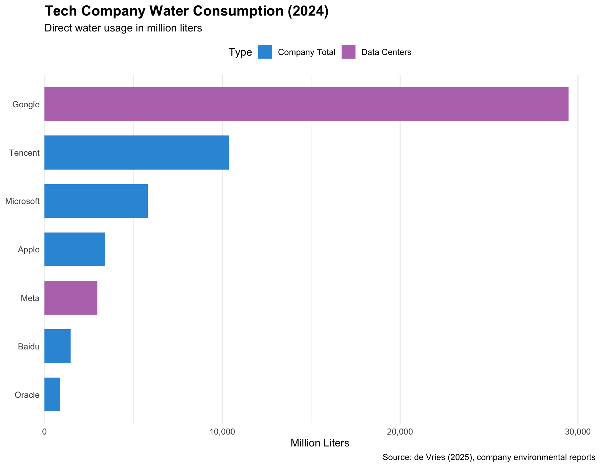
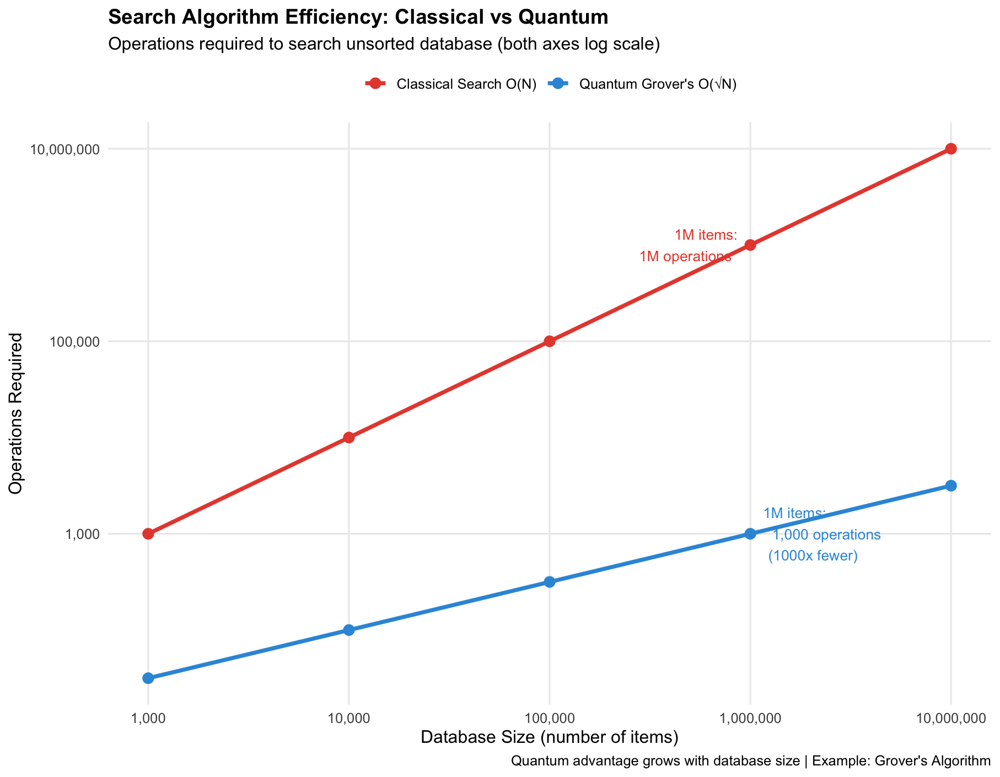

It takes ChatGPT 2.5 litres of water to use search algorithms and write your 500-word email, that's one big water bottle. Now multiply that with billions of queries asked by millions of users everyday.

In 2025, AI systems consumed between 312.5 and 764.6 billion liters of water, matching the entire global bottled water industry. You don't see it happening. Data centers are evaporating this water into thin air, literally.

*Amount of reported water consumption per unit of reported electricity consumption*

Source: [https://www.cell.com/patterns/fulltext/S2666-3899(25)00278-8](https://www.cell.com/patterns/fulltext/S2666-3899(25)00278-8)

Google's water consumption in 2024 was enough to supply Delhi, a city of 32 million people, for nearly 7 days. And it's accelerating. Google's water usage tripled between 2016 and 2024. This reflects AI's explosive growth in helping with everything from medical diagnostics to climate modeling, but the resource cost is steep.

Notice who's missing: OpenAI, Anthropic, and most AI startups. They don't own data centers. ChatGPT runs on Microsoft's Azure. Claude runs on Google Cloud and AWS. Their water footprint is hidden inside these tech giants' numbers.

Most industries use water and return it. Data centers evaporate it. 80% disappears into the atmosphere, permanently removed from local watersheds. Many of these data centers sit in water-stressed regions. Texas, facing severe droughts. Arizona, where aquifers are depleting. They're concentrating water extraction exactly where water is scarcest.

We're evaporating enough water to solve drinking water crises while communities ration water use during droughts.

*[Picture 3 to be added]*

## Why Does AI Drink So Much?

AI generates massive heat from GPU chips running at 80-90°C. A single AI rack now consumes 600kW (powers 400 homes for a day) all becoming heat. Air cooling saves water but uses 30-40% more electricity; evaporative cooling loses 80% of water forever. Economics favors evaporation. Rack power density jumped from 36kW (2023) to projected 600kW (2027) as AI explodes. More computation = more heat = more evaporated water, unless we compute differently.

## The Quantum Alternative

Quantum computers work differently. Using Grover's algorithm (quantum recipe for fast database search), they take advantage of qubits (quantum bits that can be 0 AND 1 simultaneously), where qubits exist in superposition (multiple states at once) to explore many possibilities simultaneously.

Here's the mechanics: classical computers check database entries one by one because classical bits must be either 0 or 1. A quantum computer encodes all N possibilities into a superposed quantum state (overall probability pattern of qubits). It then applies quantum gates (operations that tweak qubit probabilities) that amplify the correct answer through wave interference (right answer grows, wrong ones shrink) while canceling wrong ones.

Think of it like Google search autocomplete: it predicts all possible words instantly, highlighting the right one brighter each keystroke. After about √N steps, it locks in. For a million items, that's 1,000 steps instead of 1,000,000.

The math shifts from O(N) to O(√N). Practically, that means searching a million items takes about 1,000 steps instead of 1,000,000. This isn't just an optimization trick. It's a fundamentally different computational model based on quantum mechanics.

Fewer steps matter directly. Less computation means less electricity flowing through processors, less heat generated, and less water evaporated in cooling systems.

But we should be clear about the limits. This speedup only applies to certain kinds of problems. Quantum computers shine at search, optimization, and molecular simulation. They aren't going to run large language models like ChatGPT anytime soon.

The more realistic future is hybrid systems. Classical computers will still do most of the AI work. Quantum chips will step in for specific tasks, like database searches or parameter optimization.

Even in an optimistic case where 10 to 30% of AI computation moves to quantum by 2035, we're talking about targeted improvements, not a full replacement. The water and energy savings would be real, but they'd also be partial.

## A Partial Solution, Not a Silver Bullet

AI consumed up to 764 billion liters of water in 2025, enough to supply Delhi for two weeks or quench the thirst of 700 million people for a year. This isn't sustainable, especially as AI adoption accelerates. AI's benefits are undeniable, it's accelerating scientific research, improving healthcare accessibility, and helping tackle climate change. But we need to deliver these benefits more sustainably.

Quantum computing offers genuine hope, but tempered hope. For specific tasks like database search and optimization, quantum algorithms can reduce operations by 100 to 1000x. Fewer operations mean less heat, less cooling, and less evaporated water. The physics is sound.

But quantum won't replace AI infrastructure. It will complement it. Hybrid systems by 2035 might handle 10 to 30% of workloads quantumly, yielding modest water savings, not revolutionary ones.

The real solution is multi-pronged: better algorithms (classical and quantum), renewable energy powering data centers, advanced cooling technologies, water recycling systems, and policy limiting consumption in water-stressed regions. Quantum is one tool in this toolkit.

The question isn't whether quantum will save us from AI's thirst. It's whether we'll deploy all available solutions, quantum included, before the cost becomes unbearable. The technology exists. The choice is ours.
